# Melody's AI Colleague Team

A multi-agent Job Search Assistant built with [Claude Code](https://claude.ai/claude-code) for the Leena AI Director of Strategy & Operations assignment.

**GitHub**: [github.com/yueyinmelody0919-commits/leena-job-search-assistant](https://github.com/yueyinmelody0919-commits/leena-job-search-assistant)

> **Build something you'd actually use.** I built a miniature version of Leena's product - for my own job search.

---

## Table of Contents

- [What This Is](#what-this-is)
- [Why This Architecture](#why-this-architecture)
- [System Architecture](#system-architecture)
- [Agent Orchestration](#agent-orchestration)
- [Scoring Engine](#scoring-engine)
- [Integrations](#integrations)
- [Dashboard](#dashboard)
- [Key Technical Decisions](#key-technical-decisions)
- [Deliverables](#deliverables)
- [Setup](#setup)

---

## What This Is

An autonomous AI colleague team that finds, evaluates, and acts on job opportunities. Seven AI colleagues - each with a distinct role and an Office character personality - collaborate via Slack and a dashboard to run a job search like a GTM pipeline.

**By the numbers:**
- 11,300+ lines of TypeScript across 85 files
- 9 live external integrations (asked for 3)
- 7 AI agents with runtime-configurable capabilities
- 52+ passing tests with TDD pre-push hooks
- 14 database tables with shared memory
- 436+ messages of prompting history documented

---

## Why This Architecture

The assignment asks for a job search tool. I built a **multi-agent orchestration system** instead - because that's what Leena AI builds.

| Leena AI Product | This Project |
|---|---|
| AI Colleagues with distinct roles | 7 agents: Scout, Analyst, Strategist, Ops, Engineer, Coach, QA |
| Orchestrator coordinating agents | Central router dispatching messages to 1-3 relevant agents |
| Deep enterprise integrations | 9 live connectors with real read/write operations |
| Shared knowledge across agents | SQLite memory system with 14 tables |
| Runtime-configurable capabilities | Toggle agent capabilities on/off from the dashboard |
| Human-in-the-loop approval | Thumbs up/down feedback, manual email review before send |
| Autonomous workflows | Scheduled scans, auto-scoring, draft email generation |

This isn't a coincidence. I studied the product and built something that demonstrates I understand how it works at an architectural level.

---

## System Architecture



### Data Flow



---

## Agent Orchestration

Each agent is a `BaseAgent` instance with a character persona, a system prompt, and a set of capabilities that can be toggled at runtime from the dashboard.



**How it works:**
1. User sends a message in Slack (DM or #job-search channel)
2. The router analyzes the message and dispatches to 1-3 relevant agents
3. Each agent loads its **enabled capabilities** from the database (not hardcoded)
4. The agent calls Claude with its persona prompt + fresh context from the shared memory
5. Response is posted back to Slack using that agent's bot token

**Runtime configurability:** Every agent's capabilities can be toggled on/off from the Agents page. When a capability is disabled, it's removed from the agent's system prompt, so Claude won't attempt to use it. This mirrors Leena's approach to capability management.

### The Colleagues

| Agent | Character | Role | Key Capabilities |
|-------|-----------|------|-----------------|
| Scout | Dwight Schrute | Discovery & Research | Search JSearch, Search Adzuna, Research via Tavily |
| Analyst | Oscar Martinez | Scoring & Market Intel | Score via Claude, Update Thompson Sampling, Process feedback |
| Strategist | Jim Halpert | Outreach & Networking | Draft emails, Send via Gmail, Look up contacts |
| Ops | Angela Martin | Pipeline & Scheduling | Pipeline stages, Calendar events, Sheets tracker |
| Engineer | Darryl Philbin | Platform Development | Whitelist, Feature suggestions, Performance monitoring |
| Coach | Holly Flax | Learning & Development | Learning resources, Skill gaps, Course search |
| QA | Stanley Hudson | Quality Assurance | Bug investigation, Test monitoring, Error tracking |

---

## Scoring Engine

### Two-Pass Architecture



**Pass 1** eliminates ~70% of listings instantly with no API cost. The key design decision: seniority keywords must appear in the job **title**, not the description, to avoid false positives from JDs that mention "reports to the Director."

**Pass 2** sends each surviving job to Claude with a structured prompt that returns JSON scores across 9 dimensions. The composite score is computed using preference weights from Thompson Sampling - not Claude's self-reported overall score.

### Thompson Sampling (Preference Learning)

Each scoring dimension is modeled as a Beta(alpha, beta) distribution. When the user gives feedback:

- **Thumbs up** on a job: alpha increases for that job's high-scoring dimensions (reinforces what you like)
- **Thumbs down**: beta increases for high-scoring dimensions (penalizes overweighted criteria)
- **Thumbs up also boosts** the job's composite score to a minimum of 70, making it eligible for outreach
- **Thumbs down removes** the job from the active feed (moved to "passed" stage)

After ~30 feedback signals, the weights converge on the user's true preferences. The Preferences dashboard shows real-time weight drift.

---

## Integrations

### Integration Architecture



### Email Outreach Pipeline

The email system is a key differentiator - it doesn't just draft, it **researches, personalizes, and queues**:

1. **Contact Research**: Claude analyzes the job posting and company to find the right email (careers@company.com, or a specific recruiter)
2. **Personalized Greeting**: "Dear Recruiting Team" for generic addresses, first name for individuals
3. **Template with Context**: Body references the specific role and company, not a generic template
4. **Resume Attached**: PDF automatically attached as MIME multipart
5. **Gmail Draft**: Saved to drafts for human review - never auto-sent
6. **Slack Notification**: Digest with links to both the dashboard dossier and the Gmail draft

---

## Dashboard

Eight views, each wired to real data from the shared SQLite database:

| View | Purpose | Key Features |
|------|---------|-------------|
| **Morning Brief** | Daily overview | Stats row, approval queue (clickable), agent activity feed, scan/score buttons |
| **Job Feed** | Browse & act on jobs | Score badges, thumbs up/down, company dossier with description + radar chart + score breakdown table |
| **Pipeline** | Track job stages | Kanban board (7 stages), Sankey flow diagram |
| **Agents** | Configure agents | Activity log, capability toggles (runtime), scheduled tasks, knowledge base |
| **Network** | Contact lookup | Apollo search, batch populate from top-scored jobs |
| **Bugs** | Track issues | Auto-generated fix prompts, severity/status tracking |
| **Learning** | Skill development | Resource links, skill gap analysis |
| **Preferences** | Scoring weights | Thompson Sampling visualization, feedback history, hard filters |

### Design System

The dashboard uses Leena AI's brand palette (#0F72EE primary blue, light backgrounds, #CFE3FC borders) with Claude platform-style clean components (shadcn/ui).

---

## Key Technical Decisions

| Decision | Why |
|----------|-----|
| **SQLite over Postgres** | Single-file DB, zero infrastructure, perfect for a self-contained tool |
| **Thompson Sampling over static weights** | Real ML technique used by LinkedIn/DoorDash - demonstrates analytical sophistication |
| **Seniority filter on TITLE only** | JDs mention "Director" in descriptions ("reports to Director") - filtering on title avoids false positives |
| **Composite score computed locally** | Claude's self-reported "overall" was unreliable (all scored 32) - computing from per-dimension scores x weights fixed it |
| **7 Slack apps, not 1** | Each agent has its own bot token and avatar - feels like real colleagues, not one bot with multiple personalities |
| **Drafts, not auto-send** | Human-in-the-loop for outreach emails - the system prepares, you approve |
| **Agent configs in DB, not code** | Runtime-configurable capabilities, not hardcoded - mirrors how enterprise AI products manage agent behavior |

---

## Database Schema



14 tables total: jobs, job_scores, feedback, preferences, pipeline, contacts, knowledge, agent_logs, agent_learnings, features, skills, whitelist, bugs, agent_configs.

---

## Tech Stack

| Layer | Technology |
|-------|-----------|
| Framework | Next.js 16 (App Router) |
| UI | shadcn/ui, Tailwind CSS |
| Charts | Nivo (Sankey, Radar) |
| Database | SQLite via Drizzle ORM (@libsql/client) |
| AI | Claude API (Anthropic) |
| Slack | Bolt SDK, Socket Mode |
| Auth | Auth.js v5, Google OAuth |
| Testing | Vitest, 52+ tests |
| CI/Quality | Husky hooks (typecheck + lint pre-commit, tests pre-push) |
| Dev Tool | Claude Code (entire project built with it) |

---

## Deliverables

| Deliverable | Location | Description |
|-------------|----------|-------------|
| **Flow walkthrough** | [`docs/walkthrough-script.md`](./docs/walkthrough-script.md) | 10-15 min demo script with 7 acts and checklist |
| **Code** | This repo | 11,300+ lines, 85 files, 17 commits |
| **Scoring note** | [`SCORING_NOTE.md`](./SCORING_NOTE.md) | Half-page: two-pass architecture, Thompson Sampling, exclusions |
| **Prompting history** | [`FULL_CHAT_HISTORY.md`](./FULL_CHAT_HISTORY.md) | 233KB, 436+ messages - complete build session log |

---

## Setup

```bash
git clone https://github.com/yueyinmelody0919-commits/leena-job-search-assistant.git
cd leena-job-search-assistant
npm install
cp .env.example .env
# Fill in API keys (see .env.example)

npm run db:seed    # Initialize preferences + agent configs
npm run dev        # Dashboard at localhost:3000
npm run slack:dev  # Slack bots (separate terminal)
npm test           # 52+ passing tests
```

### Required API Keys

| Key | Source | Free Tier |
|-----|--------|-----------|
| ANTHROPIC_API_KEY | [console.anthropic.com](https://console.anthropic.com) | Pay-as-you-go |
| RAPIDAPI_KEY (JSearch) | [rapidapi.com](https://rapidapi.com) | 500 req/mo |
| ADZUNA_APP_ID + KEY | [developer.adzuna.com](https://developer.adzuna.com) | Free |
| GOOGLE_CLIENT_ID/SECRET/REFRESH_TOKEN | Google Cloud Console | Free |
| APOLLO_API_KEY | [app.apollo.io](https://app.apollo.io) | 50 credits/mo |
| TAVILY_API_KEY | [tavily.com](https://tavily.com) | 1,000 searches/mo |
| SLACK_*_BOT_TOKEN (x7) | [api.slack.com](https://api.slack.com) | Free |

---

*Built by Melody Yin using Claude Code, May 2026*
