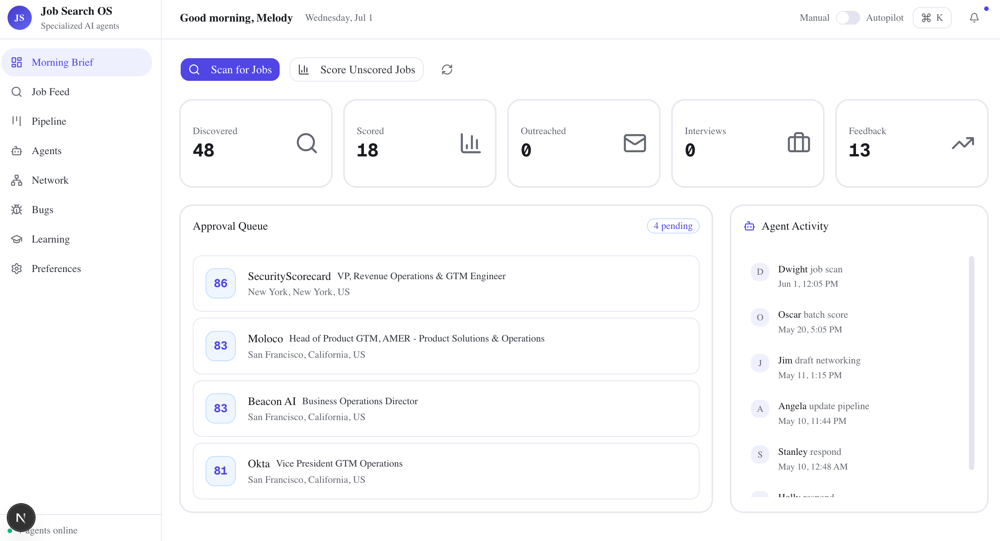
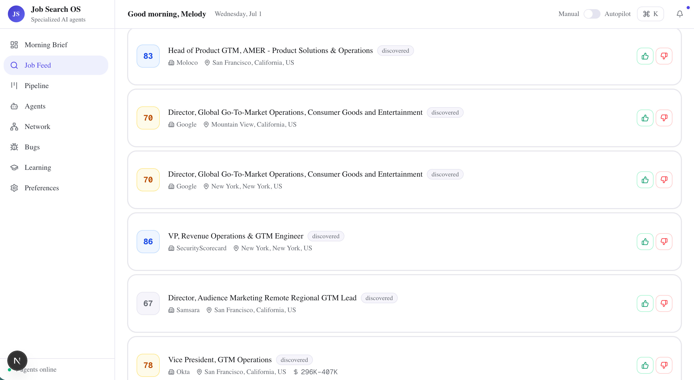
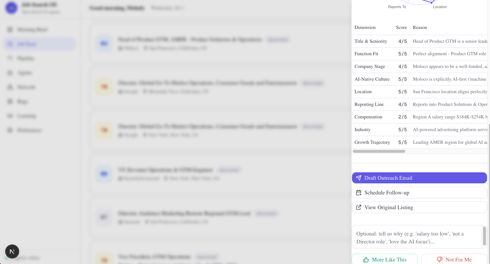
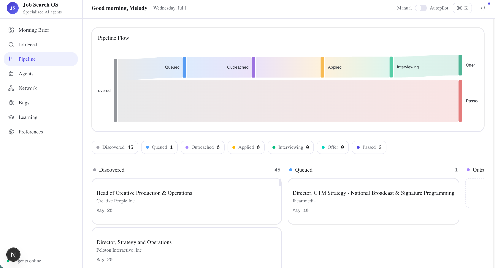
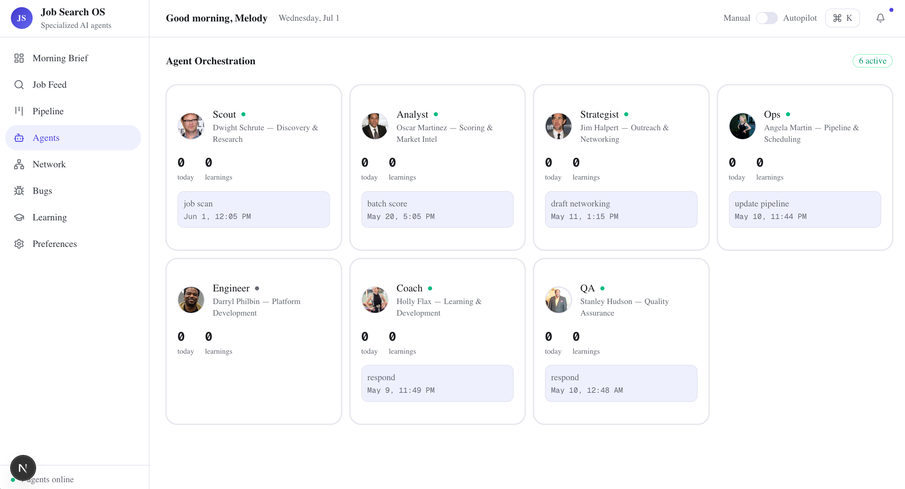
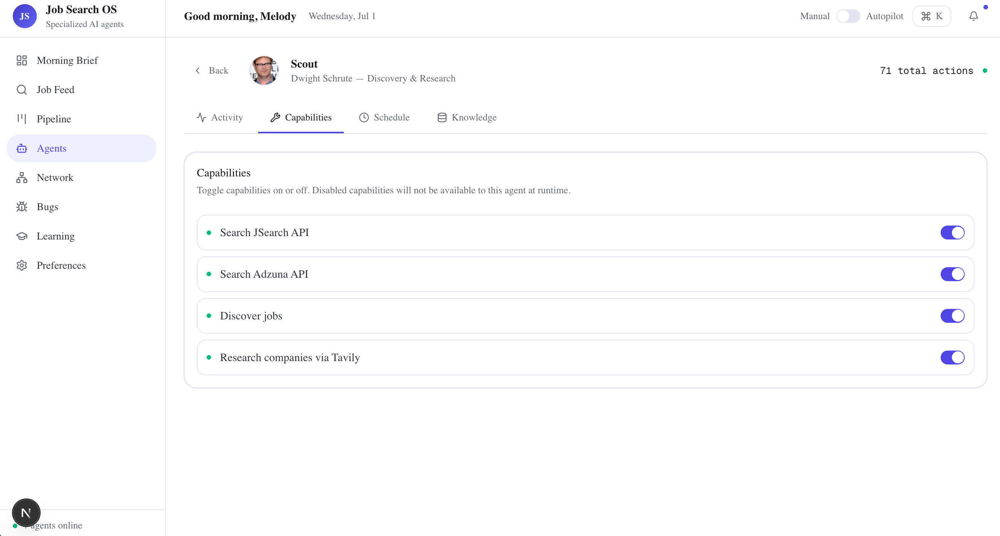
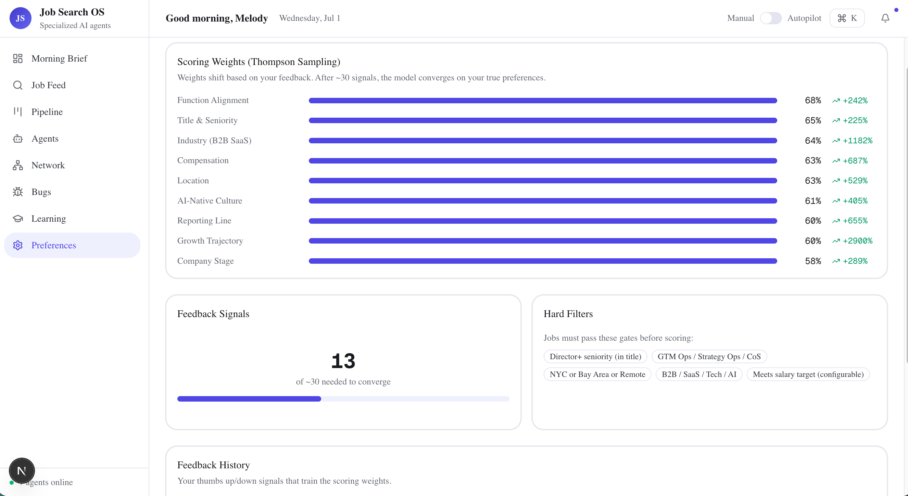
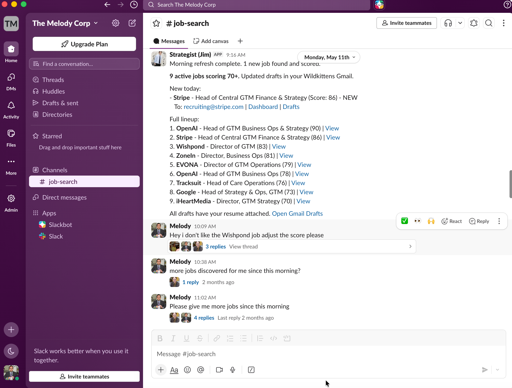

# Melody's Job Search OS

**A multi-agent operating system for the modern job search.**

Job Search OS runs a senior-level job hunt the way you'd run a small GTM
operation: a team of specialized AI agents handles discovery, evaluation,
company research, personalized outreach, pipeline tracking, and interview prep —
coordinating through a shared memory layer, a Slack workspace, and a Next.js
dashboard.

`ai-job-search-assistant` · Next.js 16 · TypeScript · Claude API · SQLite · Slack

---

## Table of Contents

- [Why This Exists](#why-this-exists)
- [What It Does](#what-it-does)
- [Screenshots](#screenshots)
- [The Agents](#the-agents)
- [System Architecture](#system-architecture)
- [Scoring Engine](#scoring-engine)
- [Outreach Pipeline](#outreach-pipeline)
- [Dashboard](#dashboard)
- [Tech Stack](#tech-stack)
- [Key Technical Decisions](#key-technical-decisions)
- [Run It Locally](#run-it-locally)
- [Configuration](#configuration)

---

## Why This Exists

A serious job search is an operations problem in disguise. You're monitoring
dozens of sources for new roles, judging each against a nuanced set of
criteria, researching companies and the people inside them, writing outreach
that doesn't read like a template, tracking everything through a pipeline, and
preparing for interviews — continuously, and mostly alone.

Most "job search tools" are a single search box bolted onto a spreadsheet. This
project takes the opposite approach: it decomposes the search into distinct
roles and gives each one to a specialized agent, so the whole thing behaves
like a team that works while you don't. It's a real system I use to run my own
search — and a demonstration of multi-agent architecture, preference learning,
and deep third-party integration built end to end.

## What It Does

- **Discovers** roles in real time across multiple job boards, with instant
  hard-filtering so only relevant listings ever enter the system.
- **Scores** every surviving job against a 9-dimension rubric using the Claude
  API, then learns your true preferences from thumbs-up/down feedback via
  Thompson Sampling.
- **Researches** companies and hiring contacts, enriching each opportunity with
  the context you'd otherwise gather by hand.
- **Drafts** personalized outreach emails — right recipient, adaptive greeting,
  role-specific body, resume attached — and saves them to Gmail for your review.
  Nothing is ever sent without you.
- **Tracks** a pipeline of opportunities through a Kanban board and conversion
  funnel.
- **Coaches** you on skill gaps and surfaces learning resources tied to the
  roles you're pursuing.
- **Talks back** in Slack: seven agents collaborate in a channel and via DMs,
  each with a memorable personality so the system is genuinely nice to use.

## Screenshots

**Morning Brief** — daily overview with live stats, an approval queue of
top-scored roles, and a real-time agent activity feed.



**Job Feed** — every discovered role with its composite score badge and
one-click thumbs up/down feedback that trains the ranking.



**Job Dossier** — per-dimension score breakdown with the model's reasoning,
plus one-click actions to draft outreach, schedule follow-ups, or open the
original listing.



**Pipeline** — a Sankey conversion funnel over a Kanban board tracking every
opportunity from discovered through offer.



**Agents** — the orchestration view: seven specialized agents, each with live
activity and runtime-toggleable capabilities.





**Preferences** — Thompson Sampling weights drifting toward your true
preferences as you give feedback, alongside the configurable hard filters.



**Slack digest** — the daily briefing posted to `#job-search`, with scores,
recipients, and links to both the dashboard dossier and the Gmail draft.



## The Agents

Each agent is a `BaseAgent` with its own system prompt, Slack identity, and a
set of capabilities you can toggle at runtime from the dashboard. When a
capability is disabled it's removed from the agent's prompt, so it simply won't
attempt that action. The personalities are an affectionate nod to *The Office* —
they make a system you live in day-to-day far more fun.

| Agent | Persona | Role | Key Capabilities |
|-------|---------|------|-----------------|
| **Scout** | Dwight | Discovery & Research | Search JSearch, search Adzuna, research companies via Tavily |
| **Analyst** | Oscar | Scoring & Market Intel | Score via Claude, update Thompson Sampling, process feedback |
| **Strategist** | Jim | Outreach & Networking | Draft emails, send via Gmail, look up contacts |
| **Ops** | Angela | Pipeline & Scheduling | Manage stages, create calendar events, update Sheets tracker |
| **Engineer** | Darryl | Platform | Manage whitelist, suggest features, monitor performance |
| **Coach** | Holly | Learning & Development | Recommend resources, identify skill gaps, search courses |
| **QA** | Stanley | Quality Assurance | Investigate bugs, monitor tests, track errors |

## System Architecture

```
                              SLACK (7 bots)
                                   |
                            Message Router
                     __________|___|___________
                    |     |     |    |    |    |
                 Scout Analyst Strat Ops Eng Coach QA
                    |     |     |    |
                    v     v     v    v
              +-----------+-----------+-----------+
              |     INTEGRATIONS (9 live systems) |
              |                                   |
              |  JSearch + Adzuna .. job listings |
              |  Gmail ........... draft/send email|
              |  Google Sheets ... pipeline tracker|
              |  Google Calendar . follow-ups      |
              |  Apollo .......... contact lookup  |
              |  Claude API ...... scoring/drafting|
              |  Tavily .......... web research    |
              +-----------+-----------+-----------+
                          |
                    SQLite (shared memory)
                    for all agents + dashboard
                          |
              +-----------+-----------+
              |   DASHBOARD (Next.js) |
              |                       |
              |  Morning Brief        |
              |  Job Feed + Dossier   |
              |  Pipeline Kanban      |
              |  Agent Settings       |
              |  Network Map          |
              |  Preferences          |
              +-----------------------+
```

A single **message router** dispatches each Slack message to the 1–3 relevant
agents. Every agent reads and writes to the same SQLite memory, so the feed,
scores, pipeline, contacts, and learnings are always consistent between Slack
and the dashboard. See [`docs/architecture.md`](./docs/architecture.md) for the
full breakdown and [`docs/diagrams/`](./docs/diagrams) for Mermaid diagrams.

## Scoring Engine

A two-pass design keeps scoring both cheap and accurate:

- **Pass 1 — Hard Filter (no LLM):** binary gates on seniority, function,
  location, company type, and an optional salary floor eliminate the majority
  of listings instantly. Seniority is checked on the job *title* only, which
  avoids false positives from JDs that merely mention "reports to the Director."
- **Pass 2 — Deep Score (Claude API):** survivors are scored across 9 weighted
  dimensions with per-dimension reasoning. The composite (0–100) is computed
  locally from per-dimension scores × preference weights — not the model's
  self-reported overall.

Weights are learned, not fixed. **Thompson Sampling** models each dimension as a
Beta distribution and updates it from your feedback, converging on your real
preferences after ~30 signals. Full details in [`docs/scoring.md`](./docs/scoring.md).

## Outreach Pipeline

The email system doesn't just fill in a template — it researches, personalizes,
and queues:

1. **Contact research** — Claude identifies the right recipient (a specific
   recruiter, or `careers@company.com`).
2. **Adaptive greeting** — "Dear Recruiting Team" for generic inboxes, first
   name for individuals.
3. **Role-specific body** — references the actual role and company.
4. **Resume attached** — as a MIME multipart attachment.
5. **Gmail draft** — saved for human review, never auto-sent.
6. **Slack digest** — links to both the dashboard dossier and the Gmail draft.

## Dashboard

Eight views, each wired to live data from the shared database:

| View | Purpose |
|------|---------|
| **Morning Brief** | Daily overview: stats, approval queue, agent activity, scan/score actions |
| **Job Feed** | Browse and act on jobs; score badges, thumbs up/down, company dossier with radar chart |
| **Pipeline** | Kanban across 7 stages + Sankey conversion funnel |
| **Agents** | Activity log, runtime capability toggles, scheduled tasks, knowledge base |
| **Network** | Contact lookup and batch enrichment from top-scored jobs |
| **Bugs** | Auto-generated fix prompts with severity/status tracking |
| **Learning** | Skill-gap analysis and curated resources |
| **Preferences** | Thompson Sampling weight visualization and feedback history |

## Tech Stack

| Layer | Technology |
|-------|-----------|
| Framework | Next.js 16 (App Router) |
| UI | shadcn/ui, Tailwind CSS |
| Charts | Nivo (Sankey, Radar), Recharts, React Flow |
| Database | SQLite via Drizzle ORM (`@libsql/client`) |
| AI | Claude API (Anthropic) |
| Slack | Bolt SDK, Socket Mode |
| Auth | Auth.js v5, Google OAuth |
| Testing | Vitest, Husky pre-commit/pre-push hooks |

## Key Technical Decisions

| Decision | Why |
|----------|-----|
| **SQLite over Postgres** | Single-file DB, zero infra, ideal for a self-contained personal tool |
| **Thompson Sampling over static weights** | Real preference learning that adapts to your feedback |
| **Seniority filter on title only** | JDs mention "Director" in passing; title-only filtering avoids false positives |
| **Composite score computed locally** | The model's self-reported overall was unreliable; per-dimension × weights is stable |
| **7 Slack apps, not 1** | Each agent has its own token and avatar — it feels like a team, not one bot wearing masks |
| **Drafts, not auto-send** | Human-in-the-loop for all outreach — the system prepares, you approve |
| **Agent configs in the DB** | Capabilities are runtime-configurable, not hardcoded |

## Run It Locally

```bash
git clone <your-fork-url> ai-job-search-assistant
cd ai-job-search-assistant
npm install
cp .env.example .env
# Fill in your profile + API keys (see Configuration below)

npm run db:seed    # Initialize preferences + agent configs
npm run dev        # Dashboard at http://localhost:3000
npm run slack:dev  # Slack bots (separate terminal, optional)
npm test           # Run the test suite
```

Drop your resume at `./data/resume.pdf` (git-ignored) so outreach drafts can
attach it, or point `RESUME_PATH` elsewhere.

## Configuration

Personalize the search by editing `.env` — the dashboard and agents adapt
automatically:

| Variable | Purpose |
|----------|---------|
| `OWNER_EMAIL` | Whitelisted login + default recipient for self/test emails |
| `SENDER_NAME` / `SENDER_CONTACT` / `SENDER_LINKEDIN` | Identity used in outreach drafts |
| `SENDER_BIO` | Optional bio paragraph inserted into outreach |
| `RESUME_PATH` / `RESUME_FILENAME` | Resume attached to drafts |
| `CANDIDATE_PROFILE` | Overrides the profile the scorer evaluates against |
| `MIN_SALARY_FLOOR` | Optional Pass-1 salary floor (0 = disabled) |

### API keys

| Key | Source | Free Tier |
|-----|--------|-----------|
| `ANTHROPIC_API_KEY` | [console.anthropic.com](https://console.anthropic.com) | Pay-as-you-go |
| `RAPIDAPI_KEY` (JSearch) | [rapidapi.com](https://rapidapi.com) | 500 req/mo |
| `ADZUNA_APP_ID` + `KEY` | [developer.adzuna.com](https://developer.adzuna.com) | Free |
| `GOOGLE_CLIENT_ID`/`SECRET`/`REFRESH_TOKEN` | Google Cloud Console | Free |
| `APOLLO_API_KEY` | [app.apollo.io](https://app.apollo.io) | 50 credits/mo |
| `TAVILY_API_KEY` | [tavily.com](https://tavily.com) | 1,000 searches/mo |
| `SLACK_*_BOT_TOKEN` (×7) | [api.slack.com](https://api.slack.com) | Free |

Slack is optional — the dashboard runs standalone. See
[`docs/slack-setup.md`](./docs/slack-setup.md) for the full bot setup guide.

---

*Built by Melody Yin with Claude Code.*
