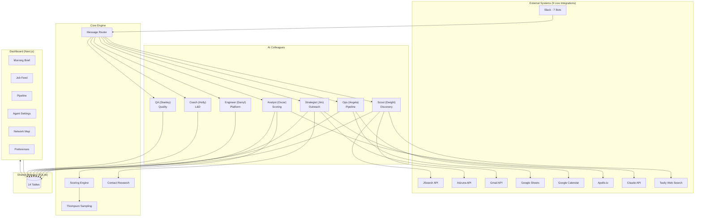

```mermaid
graph TB
    subgraph External["External Systems (9 Live Integrations)"]
        JS[JSearch API]
        AZ[Adzuna API]
        GM[Gmail API]
        GS[Google Sheets]
        GC[Google Calendar]
        AP[Apollo.io]
        SL[Slack - 7 Bots]
        CL[Claude API]
        TV[Tavily Web Search]
    end

    subgraph Core["Core Engine"]
        OR[Message Router]
        SC[Scoring Engine]
        TS[Thompson Sampling]
        CT[Contact Research]
    end

    subgraph Agents["AI Colleagues"]
        A1["Scout (Dwight)\nDiscovery"]
        A2["Analyst (Oscar)\nScoring"]
        A3["Strategist (Jim)\nOutreach"]
        A4["Ops (Angela)\nPipeline"]
        A5["Engineer (Darryl)\nPlatform"]
        A6["Coach (Holly)\nL&D"]
        A7["QA (Stanley)\nQuality"]
    end

    subgraph Data["Shared Memory (SQLite)"]
        DB[(14 Tables)]
    end

    subgraph UI["Dashboard (Next.js)"]
        MB[Morning Brief]
        JF[Job Feed]
        PL[Pipeline]
        AG[Agent Settings]
        NW[Network Map]
        PR[Preferences]
    end

    SL --> OR
    OR --> A1 & A2 & A3 & A4 & A5 & A6 & A7
    A1 --> JS & AZ & TV
    A2 --> CL & SC
    A3 --> GM & AP & CT
    A4 --> GS & GC
    SC --> TS
    A1 & A2 & A3 & A4 & A5 & A6 & A7 --> DB
    DB --> UI
    UI --> DB
```
